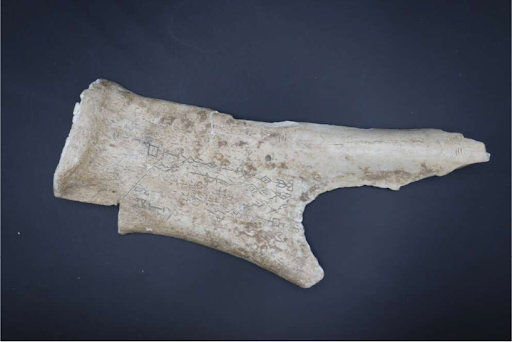
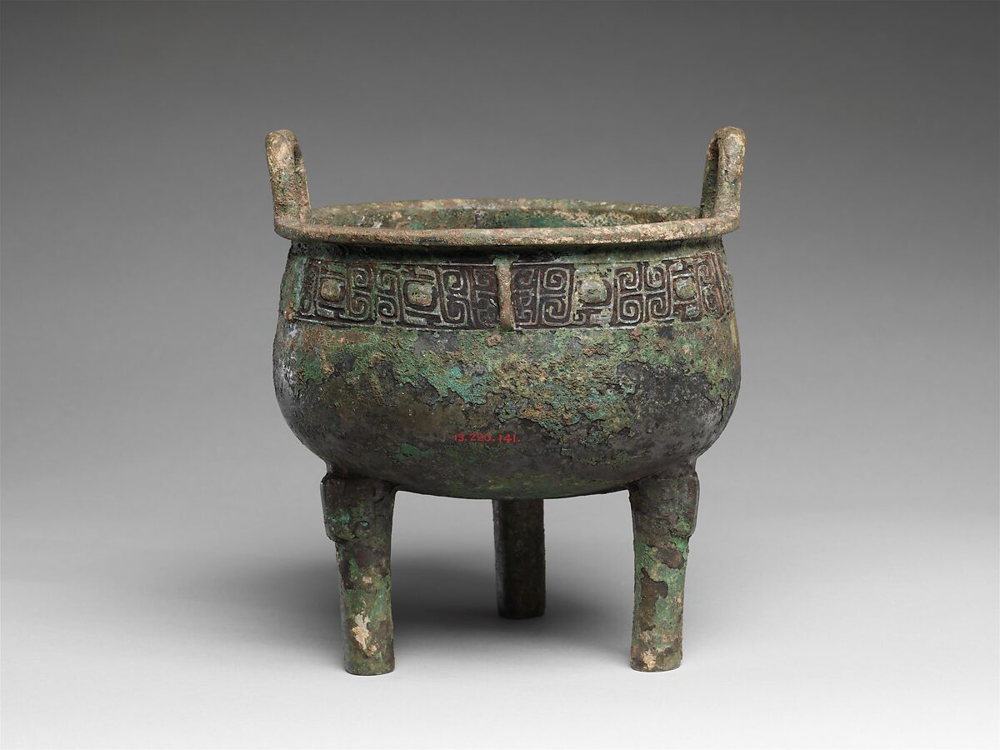
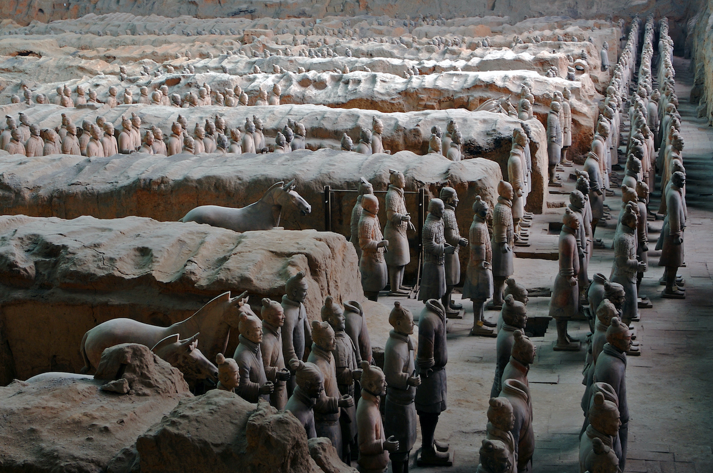

# Three Foundations of Ancient China: Writing, Bronze, and Empire

Despite producing countless later achievements, three developments were the most historically significant to the creation of ancient Chinese civilization: oracle bone inscriptions, which gave China its first writing system and the ability to record history; bronze ritual vessels, which made possible metallurgy and ancestor-worship religion that defined Shang kingship; and the Terracotta Army, which symbolizes Qin Shi Huang’s unification of the warring states in 221 BCE and the birth of China as a single empire.

### Artifact 1: Oracle Bones

*Oracle Bone Inscription, Shang Dynasty, British Museum*

Oracle bones are pieces of ox shoulder blades or turtle shells that Shang kings and priests used for divination. They carved questions (like about rain, wars, or harvests) into the bone, heated it until it cracked, then read the cracks as answers from ancestors or gods. These are the earliest known examples of Chinese writing.

Oracle bones created the first full Chinese writing system around 1200 BCE. This writing allowed the Shang to record history, questions, and royal decisions, making the Shang the first Chinese dynasty we can study through their own words instead of just legends. It gave birth to the script that became the foundation of all later Chinese civilization.

The writing system from oracle bones evolved directly into modern Chinese characters, still used by over 1.4 billion people today more than 3,000 years later. No other ancient writing system has lasted this long in continuous use.

### Artifact 2: Bronze Ritual Vessels

*Ritual Tripod Vessel (Ding), Shang Dynasty, Metropolitan Museum of Art*

Bronze ritual vessels, especially the three-legged ding cauldrons, were large pots cast from bronze that Shang kings and nobles used to cook and offer food (like meat) to their ancestors during religious ceremonies.

These vessels marked the peak of Shang bronze technology around 1600-1046 BCE. Producing them required large workshops controlled by the king, showing a strong central government and organized society. They were used in ancestor worship rituals that kept the king's divine rule legitimate and helped create the religious traditions at the heart of early Chinese civilization.

The Shang dynasty likely had several million people living in its core area (estimates range from 5-13 million across the Yellow River valley). Bronze vessels were mainly for the royal family and elites, but making them needed thousands of workers (miners, smelters, casters). The rituals reinforced the social hierarchy that controlled farming, war, and daily life for everyone in the kingdom.

### 3. Artifact 3: Terracotta Army

Terracotta Army Warriors in Formation

The Terracotta Army is a massive collection of over 8,000 life-size clay soldiers, horses, and chariots buried with China's first emperor, Qin Shi Huang. Each warrior has a unique face and armor, arranged in battle formation like a real army.

Built around 210 BCE, the Terracotta Army marks the moment Qin Shi Huang unified the warring states into one empire, the birth of imperial China. It was made to protect the emperor in the afterlife and shows the huge power, organization, and military strength that created the Qin Dynasty and started 2,000 years of unified Chinese rule.

The Qin empire had an estimated population of 20-30 million people. Building the army and tomb used over 700,000 workers for decades, and the unification it celebrates ended wars that had killed millions while bringing standard laws, roads, and writing that changed daily life for everyone in the new empire.

I chose ancient China for this exhibit because of my interest in technology and innovation. As a child, I was fascinated by reading about early Chinese inventions like paper and gunpowder in history books. Those memories sparked my curiosity and led me to explore the deeper foundations of this remarkable civilization.

As we have seen through the oracle bones, bronze ritual vessels, and Terracotta Army, these three artifacts were clearly the most historically significant developments in the creation of ancient Chinese civilization.

## Bibliography
"Chinese Bronzes: The Shang Dynasty (c. 1600–1046 BCE)." Britannica. Accessed December 12, 2025. https://www.britannica.com/art/Chinese-bronzes/The-Shang-dynasty-c-1600-1046-bce.

"Ding (Vessel)." Wikipedia. Accessed December 12, 2025. https://en.wikipedia.org/wiki/Ding_(vessel).

"Oracle Bone." Smarthistory. Accessed December 12, 2025. https://smarthistory.org/oracle-bone/.

"Oracle Bone, Shang Dynasty." British Museum. Accessed December 12, 2025. https://www.britishmuseum.org/collection/object/A_1911-1111-2.

"Oracle Bones." World History Encyclopedia. Last modified February 26, 2016. https://www.worldhistory.org/Oracle_Bones/.

"Oracle Bone Script." Wikipedia. Accessed December 12, 2025. https://en.wikipedia.org/wiki/Oracle_bone_script.

"Ritual Tripod Cauldron (Ding)." Metropolitan Museum of Art. Accessed December 12, 2025. https://www.metmuseum.org/art/collection/search/53555.

"Terra-cotta Army." Britannica. Accessed December 12, 2025. https://www.britannica.com/topic/terra-cotta-army.

"Terracotta Army." Wikipedia. Accessed December 12, 2025. https://en.wikipedia.org/wiki/Terracotta_Army.

"The Terracotta Warriors." Smarthistory. Accessed December 12, 2025. https://smarthistory.org/the-terracotta-warriors/.
