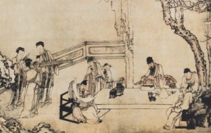
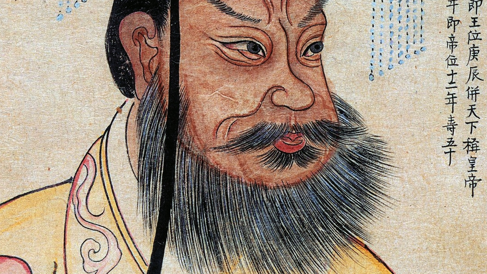

# Decree of Qin Shi Huang: Life Under the Unified Empire After the Conquest of Qi

I am Qin Shi Huang, First Emperor of China. Your lands are now part of the unified empire. Resistance is ended, peace and order begin. To ensure a smooth joining of our peoples, I proclaim this decree so you may understand daily life under my rule. Obey, and you will prosper in this new age.

### 1. Family Life

*Daily Life in an Ancient Chinese Family Home*

In family life, strong order and respect will build our empire. The father is head of the home, just like I am head of the state. Everyone in the house must obey the father. Many generations will live together: grandparents, parents, and children in one house, working the fields and helping each other. Children must show full respect to parents, and sons will carry on family duties, including rituals for ancestors, while passing land to the next male generation.

### 2. Religion

*Ancestor Worship Altar with Offerings*

In matters of religion, loyalty to family and state will guide you. You will honor your ancestors with food offerings, incense, and prayers at home altars to keep their spirits happy and bring blessings to the living. Other old beliefs and charms are no longer allowed, only the state decides what serves the empire. I, your emperor, perform the great sacrifices to Heaven for the good of all people.

### 3. Law and Politics

*Qin Shi Huang, First Emperor of China*

In law and politics, strict order will bring strength and unity to our empire. All power comes from me, the emperor. Local officials are chosen and appointed directly by the central court, not passed down in families. Laws are clear and the same for everyone, with harsh punishments for crimes to keep peace and stop wrongdoing. Families and neighbors must watch each other. If one person breaks the law, the whole group can be punished. This encourages everyone to report crimes and obey.

People of Qi, these are the foundations of life in my unified China: strong families, proper reverence for ancestors, and strict laws under one ruler. Follow them faithfully, and together we will prosper and build greatness!

## Bibliography

"Ancestor Veneration in China." Wikipedia. Accessed December 14, 2025. https://en.wikipedia.org/wiki/Ancestor_veneration_in_China.

"Daily Life in Ancient China." Ducksters. Accessed December 14, 2025. https://www.ducksters.com/history/china/daily_life.php.

"Legalism." World History Encyclopedia. Last modified January 31, 2016. https://www.worldhistory.org/Legalism/.

"Qin Dynasty." Britannica. Accessed December 14, 2025. https://www.britannica.com/topic/Qin-dynasty.

"Qin Dynasty." Wikipedia. Accessed December 14, 2025. https://en.wikipedia.org/wiki/Qin_dynasty.

"Qin Shi Huang." National Geographic. Accessed December 14, 2025. https://i.natgeofe.com/n/1501a526-7208-4990-80cb-66162c008b17/qin-shi-huangdi-og_16x9.jpg?w=1200.

"Religion in Ancient China." World History Encyclopedia. Last modified April 21, 2016. https://www.worldhistory.org/article/891/religion-in-ancient-china/.

"Qin Dynasty." World History Encyclopedia. Accessed December 14, 2025. https://www.worldhistory.org/Qin_Dynasty/.

"Ancestor Worship Altar with Offerings." Wikimedia Commons. Accessed December 14, 2025. https://upload.wikimedia.org/wikipedia/commons/e/ee/%E7%AB%A5%E6%B0%8F%E5%AE%97%E7%A5%A0_%E4%BE%9B%E5%93%81.jpg.

"Daily Life in an Ancient Chinese Family Home." Ducksters. Accessed December 14, 2025. https://www.ducksters.com/history/china/daily_life2.jpg.
