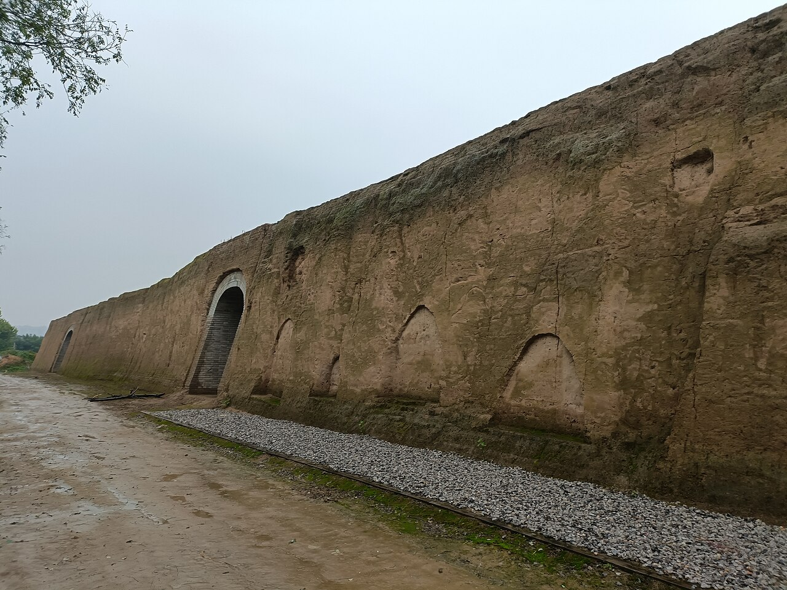
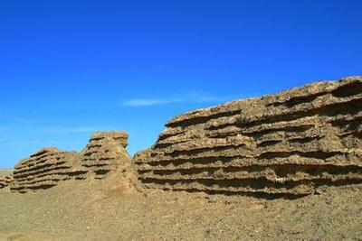
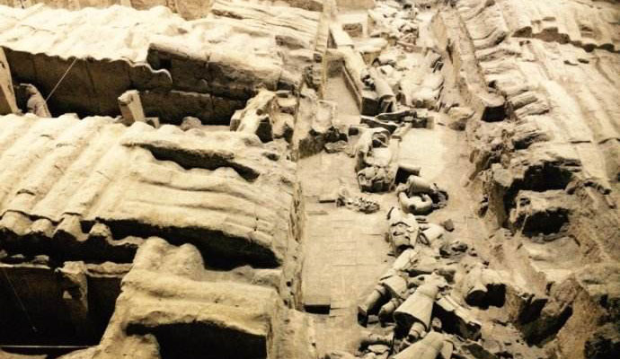

# The Fall of the Qin: Three Artifacts That Reveal a Dynasty's Swift Collapse

Although Qin Shi Huang's unification of China in 221 BCE promised lasting peace and strength through ambitious projects, his overreaching demands instead triggered the dynasty's swift collapse just 15 years later. Three artifacts reveal this decline: the unfinished ruins of the Epang Palace, whose enormous scale exhausted resources and sparked resentment; the early sections of the Great Wall, built at the cost of countless forced laborers' lives and fueling widespread revolts; and the damaged and burned figures of the Terracotta Army, smashed in rebellions shortly after the emperor's death; evidence of how quickly his regime fell.

### Artifact 1: Epang Palace Ruins:

*Rammed-Earth Platform of Unfinished Epang Palace*

The ruins of the Epang Palace stand as a massive rammed-earth platform near Xi'an, the only surviving part of what Qin Shi Huang planned as the grandest palace in history. Construction began in 212 BCE, using over 700,000 forced laborers to build a foundation over 1,300 meters long and 400 meters wide which was big enough to hold hundreds of halls. The project stayed unfinished when the emperor died in 210 BCE, and workers shifted to his tomb.

This artifact directly links to the Qin's quick decline. Heavy taxes and brutal labor for the palace drained money and angered people across the empire. After Qin Shi Huang's death, resentment exploded into revolts that toppled the dynasty in just 15 years. The unfinished ruins show how the emperor's huge ambitions wasted resources and caused widespread suffering, speeding the empire's fall.

The Epang Palace shows both continuity and change in ancient Chinese building styles. It continued older traditions of grand palaces and rammed-earth bases from earlier dynasties, keeping the idea of rulers displaying power through big structures. But the scale changed rapidly and negatively, far larger than anything before. It demanded forced labor on a massive level that exhausted the people and treasury. This sudden overreach marked a turning point: it helped end the Qin Dynasty quickly, warning future rulers against excess. Later dynasties built impressive palaces but learned to avoid such extreme projects that could spark rebellion.

### Artifact 2: Qin Dynasty Great Wall Sections:

*Ruins of Qin Dynasty Great Wall Section*

The surviving sections of the Qin Dynasty Great Wall are mostly low, eroded rammed-earth mounds scattered across northern China, such as remnants in Inner Mongolia and Gansu Province. Qin Shi Huang ordered these linked and expanded starting around 221 BCE, using local soil packed between wooden frames to create a barrier over 5,000 kilometers long against northern nomads.

This artifact ties directly to the Qin's rapid decline. The project relied on forced labor from hundreds of thousands of soldiers, peasants, and criminals—many died from exhaustion, cold, or hunger. High taxes to fund it and the loss of workers from farms caused widespread anger. After the emperor's death in 210 BCE, these hardships sparked major revolts that ended the dynasty by 206 BCE.

The Qin Great Wall reflects both continuity and change in Chinese defense strategies. It continued the tradition of border walls built by earlier states during the Warring States period, maintaining the basic idea of protecting farmland from nomads. However, the change was rapid and negative: Qin made it far larger and more centralized, demanding massive forced labor that drained the economy and people's strength. This extreme scale proved a turning point, it did little to stop real threats but helped cause the dynasty's quick fall through overwork and rebellion. Later dynasties rebuilt parts more carefully, learning from Qin's mistakes.

### Artifact 3: Damaged Terracotta Army

*Damaged Terracotta Warriors from Qin Tomb*

The damaged figures of the Terracotta Army appear today as scattered clay fragments and broken warriors in the pits near Xi'an, many showing clear signs of burning, crushing, and missing weapons. Archaeologists found thousands of shattered pieces when excavating in the 1970s, with evidence of fire damage on the figures and burnt wooden roof beams that once covered the underground pits.

This artifact connects straight to the Qin's sudden decline. Shortly after Qin Shi Huang's death in 210 BCE, rebel leader Xiang Yu and his forces looted the tomb complex, stole bronze weapons, smashed many figures, and set fire to the pits which caused the roofs to collapse and crush the army below. This destruction happened during the widespread uprisings that ended the dynasty by 206 BCE, proving how fast the emperor's power vanished.

The damaged Terracotta Army highlights both continuity and change in ancient Chinese burial practices. It continued the old tradition of placing goods and figures in tombs to serve rulers in the afterlife, a custom seen in earlier dynasties. But the changes were fast and harmful: the huge size used up too many resources while the emperor was alive, and the quick smashing and burning right after his death proved how weak his rule was. This was a big turning point, the violent end of the Qin warned against cruel and strict laws, and it led straight to the Han Dynasty, which chose milder and more balanced ways to govern.

## Bibliography

"Afang Palace Front Hall Site." Wikimedia Commons. Accessed December 15, 2025. https://upload.wikimedia.org/wikipedia/commons/f/f3/%E9%98%BF%E6%88%BF%E5%AE%AB%E5%89%8D%E6%AE%BF%E9%81%97%E5%9D%80%E5%A4%AF%E5%9C%9F%E5%8F%B0%E8%A5%BF%E4%BE%A7_2023-10-01_10.jpg.

"Epang Palace." Wikipedia. Accessed December 15, 2025. https://en.wikipedia.org/wiki/Epang_Palace.

"Epang Palace Site." China Culture. Accessed December 15, 2025. https://en.chinaculture.org/library/2008-02/15/content_36789.htm.

"Great Wall of China." Britannica. Accessed December 15, 2025. https://www.britannica.com/topic/Great-Wall-of-China.

"History of the Great Wall of China." Wikipedia. Accessed December 15, 2025. https://en.wikipedia.org/wiki/History_of_the_Great_Wall_of_China.

"How China's Terracotta Warriors Were Nearly Destroyed." The Telegraph. Accessed December 15, 2025. https://www.telegraph.co.uk/news/worldnews/asia/china/9323791/How-Chinas-Terracotta-Warriors-were-nearly-destroyed.html.

"Labor Force for Great Wall Construction." Travel China Guide. Accessed December 15, 2025. https://www.travelchinaguide.com/china_great_wall/construction/labor_force.htm.

"Qin Dynasty." Britannica. Accessed December 15, 2025. https://www.britannica.com/topic/Qin-dynasty.

"Qin Dynasty Great Wall." Travel China Guide. Accessed December 15, 2025. https://www.travelchinaguide.com/china_great_wall/history/qin/.

"Qin Dynasty Great Wall Section." Xian Private Tour. Accessed December 15, 2025. https://www.xianprivatetour.com/upload/ueditor/image/20180902/6367149219842150427977793.jpg.

"Terra-cotta Army." Britannica. Accessed December 15, 2025. https://www.britannica.com/topic/terra-cotta-army.

"Terracotta Army." Wikipedia. Accessed December 15, 2025. https://en.wikipedia.org/wiki/Terracotta_Army.

"The Magnificent Ruin: The Rise and Fall of the Epang Palace in Qin Dynasty China." Ancient War History. Accessed December 15, 2025. https://ancientwarhistory.com/the-magnificent-ruin-the-rise-and-fall-of-the-epang-palace-in-qin-dynasty-china/.
