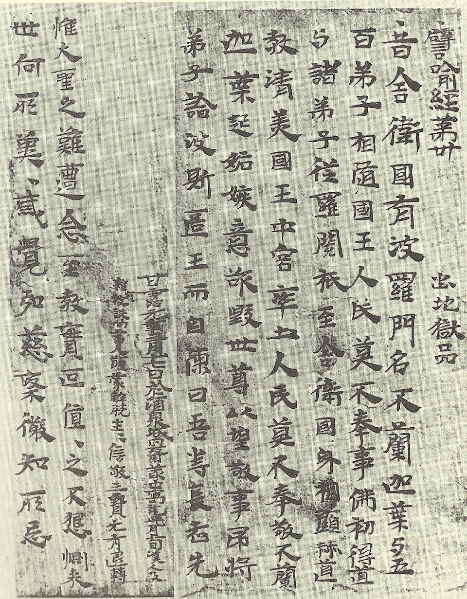
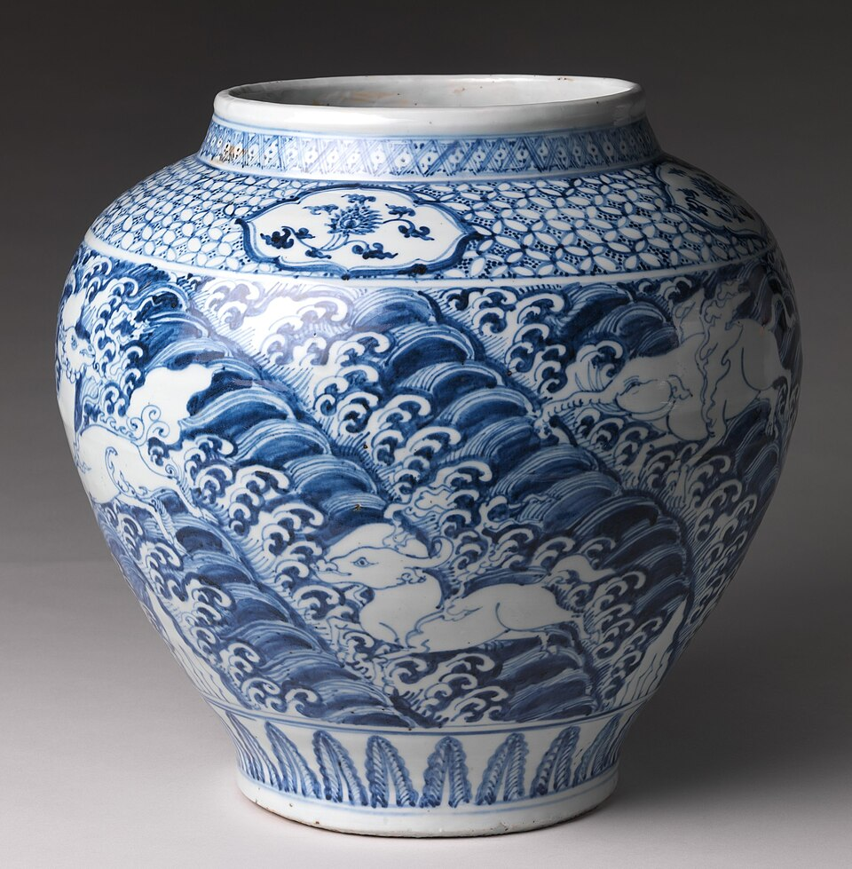
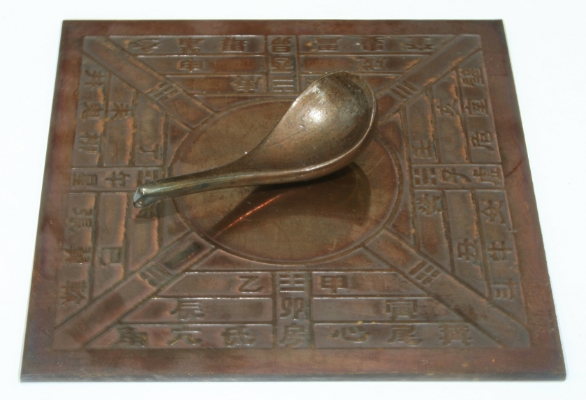

# 3 Artifacts With Lasting Legacies From Ancient China: Paper, Blue-and-white Porcelain, and the Compass

Ancient China produced many inventions that shaped the world, but three stand out for their lasting legacies: paper, blue-and-white porcelain, and the magnetic compass. Paper, invented in the Han Dynasty around 105 CE by Cai Lun, made recording and sharing knowledge far easier and cheaper than bamboo or silk, spreading literacy and ideas across civilizations. Blue-and-white porcelain, perfected during the Yuan and Ming dynasties, offered a strong, translucent, heat-resistant material that didn't chip or stain like ordinary pottery, becoming a global trade luxury that influenced ceramics everywhere. The compass, developed in the Han and improved in the Song, allowed reliable sea navigation beyond sight of land, enabling safer exploration and trade routes. These inventions remain essential today: paper in books and printing, porcelain in tableware, and compasses in modern navigation tools.

### Artifact 1: Ancient Paper:

*Oldest Paper Book, Pi Yu Jing, Composed of Six Different Materials*

The earliest forms of paper appeared in China during the Western Han Dynasty, with fragments found dating back to around 179-141 BCE. However, the major improvement came in 105 CE when court official Cai Lun reported a better method to Emperor He of the Eastern Han Dynasty. Cai Lun made paper by mixing mulberry bark, hemp, old rags, and fishing nets into a pulp, then spreading it thin and drying it into sheets. This created a light, cheap material much easier to write on than heavy bamboo strips or expensive silk. Before paper, books were bulky and hard to carry; Cai Lun's version made writing and records far more practical for government, scholars, and daily use.

Paper's historical significance is enormous because it made sharing knowledge and ideas much easier across generations and civilizations. Before paper, writing was done on heavy bamboo strips or expensive silk, so books were rare and only the rich could afford education or keep records. Cai Lun's cheaper, lighter sheets changed that. As a result, government offices, scholars, and ordinary people could now write, read, and learn more widely. This caused a slow but steady spread of literacy in China, then to the Islamic world by the 8th century and Europe by the 12th century, leading to the printing revolution. From a historical perspective, paper was a turning point: it remained a core tool for recording human thought over centuries, but enabled massive change by making information accessible to far more people. Today, even in the digital age, paper remains relevant in books, documents, and packaging, used by billions daily.

### Artifact 2: Blue-and-White Porcelain:

*Ming Dynasty Blue and White Porcelain Jar*

Blue-and-white porcelain refers to white ceramic pieces painted with cobalt blue designs under a clear glaze, fired at high temperatures to create a strong, shiny finish. Early examples appeared in the Tang Dynasty (618–907 CE), but the classic style developed in the Yuan Dynasty (1271–1368) at Jingdezhen kilns, using imported cobalt from the Middle East. Potters painted patterns like flowers, dragons, or landscapes by hand before glazing and firing. The Ming Dynasty (1368–1644) perfected it, producing jars, plates, and vases with bright blue on pure white. The pieces were thin, translucent, and ringing like a bell when tapped.

This artifact shows huge historical significance as a symbol of Chinese craftsmanship and trade power. At the time, it was a luxury item for emperors and wealthy people, showing status and beauty. The cobalt technique came from cultural exchange with Islamic regions, where blue-on-white ideas started in 9th-century Iraq. Cause and consequence: mass production in Jingdezhen created jobs but also drove global trade. Millions of pieces of porcelain were exported via the Silk Road and sea routes, making China rich and famous.

From continuity and change: it continued older Chinese pottery and painting traditions, but the high-fired porcelain body and vivid blue marked a big positive change: stronger and more beautiful than regular pottery. This spread slowly at first, then rapidly in Ming/Qing as demand grew. From a historical perspective, it was a turning point: Europeans copied it (like Delftware in Netherlands), starting local industries. Today, it's still relevant: in fine dinnerware worldwide, it inspires modern design, and "china" means porcelain in English.

### 3. Compass

*Han Dynasty Loadstone Compass*

The Han Dynasty lodestone compass, often called the "south-pointing spoon" (sinan), was a simple device made from naturally magnetic lodestone carved into a spoon shape and placed on a smooth bronze plate. When balanced carefully, the spoon's handle would spin and always point south due to Earth's magnetic field. First mentioned in records from the Han Dynasty (around 200 BCE to 220 CE), it was mainly used for divination, fortune-telling, and feng shui to align buildings or choose lucky sites. Later versions included floating magnetized needles in water bowls.

This artifact has huge historical significance as one of ancient China's Four Great Inventions. At the time, it helped people harmonize with nature through geomancy, affecting decisions about homes, tombs, and cities. Cause and consequence: its discovery of magnetism led to better versions in the Song Dynasty, first used for military direction around 1040 CE and then sea navigation by 1111 CE, allowing longer voyages and bigger trade networks.

From continuity and change: it continued ancient Chinese focus on harmony with the universe, but the shift to navigation was a rapid positive change, making sea travel safer in fog or clouds. From a historical perspective, it was a turning point: spreading to the Arab world and Europe by the 13th century, it enabled the Age of Exploration and global trade. Today, the principle lives on in every compass, GPS, and navigation app, still guiding billions.

As we have explored in this blog series, ancient China's inventions left timeless legacies that shaped the world. Paper made knowledge cheap and accessible to far more people; blue-and-white porcelain provided a stronger, more beautiful alternative to ordinary pottery; and the compass laid the foundation for safe navigation that powers modern devices. Each was deeply significant when created and remains essential today.

Studying ancient China has been fascinating, revealing a civilization whose innovations continue to influence daily life thousands of years later.

## Bibliography

"Blue and White Pottery." Wikipedia. Accessed December 17, 2025. https://en.wikipedia.org/wiki/Blue_and_white_pottery.

"Cai Lun." Britannica. Accessed December 17, 2025. https://www.britannica.com/biography/Cai-Lun.

"China Blue and White Porcelain." China Highlights. Accessed December 17, 2025. https://www.chinahighlights.com/travelguide/culture/china-blue-white-porcelain.htm.

"Early Chinese Compass." Magnet Academy. Accessed December 17, 2025. https://nationalmaglab.org/magnet-academy/history-of-electricity-magnetism/museum/early-chinese-compass-400-bc/. 

"Four Great Inventions of Ancient China." Travel China Guide. Accessed December 17, 2025. https://www.travelchinaguide.com/intro/focus/inventions.htm. 

"Han Dynasty Lodestone Compass." Wikipedia. Accessed December 17, 2025. https://en.wikipedia.org/wiki/History_of_the_compass#/media/File:Model_Si_Nan_of_Han_Dynasty.jpg. 

"History of Paper." Wikipedia. Accessed December 17, 2025. https://en.wikipedia.org/wiki/History_of_paper. 

"History of the Compass." Wikipedia. Accessed December 17, 2025. https://en.wikipedia.org/wiki/History_of_the_compass. 

"Ming Dynasty Blue-and-White Porcelain Jar." Wikipedia. Accessed December 17, 2025. https://en.wikipedia.org/wiki/Blue_and_white_pottery#/media/File:MET_DP342705_(cropped).jpg. 

"Oldest Paper Book, Pi Yu Jing." Wikipedia. Accessed December 17, 2025. https://en.wikipedia.org/wiki/History_of_paper#/media/File:Paperbook+256.jpg. 

"Paper in Ancient China." World History Encyclopedia. Last modified September 15, 2017. https://www.worldhistory.org/article/1120/paper-in-ancient-china/. 

"Religion in Ancient China." World History Encyclopedia. Last modified April 21, 2016. https://www.worldhistory.org/article/891/religion-in-ancient-china/. 

"Shades of Blue: Subtle Differences in Chinese Blue and White Porcelain." Christie's. Accessed December 17, 2025. https://www.christies.com/en/stories/shades-of-blue-subtle-differences-in-chinese-blue-and-white-porcelain-775ffe5d69b54ed08e65ac8a625a1287. 

"The Global Impact of Chinese Blue and White Porcelain." Gauche Expert. Accessed December 17, 2025. https://www.gauchetexpert.com/en/post/the-global-impact-of-chinese-blue-and-white-porcelain-a-tapestry-of-trade-technology-and-exchange. 

"The Invention of Paper." ThoughtCo. Last modified May 6, 2025. https://www.thoughtco.com/invention-of-paper-195265. 
